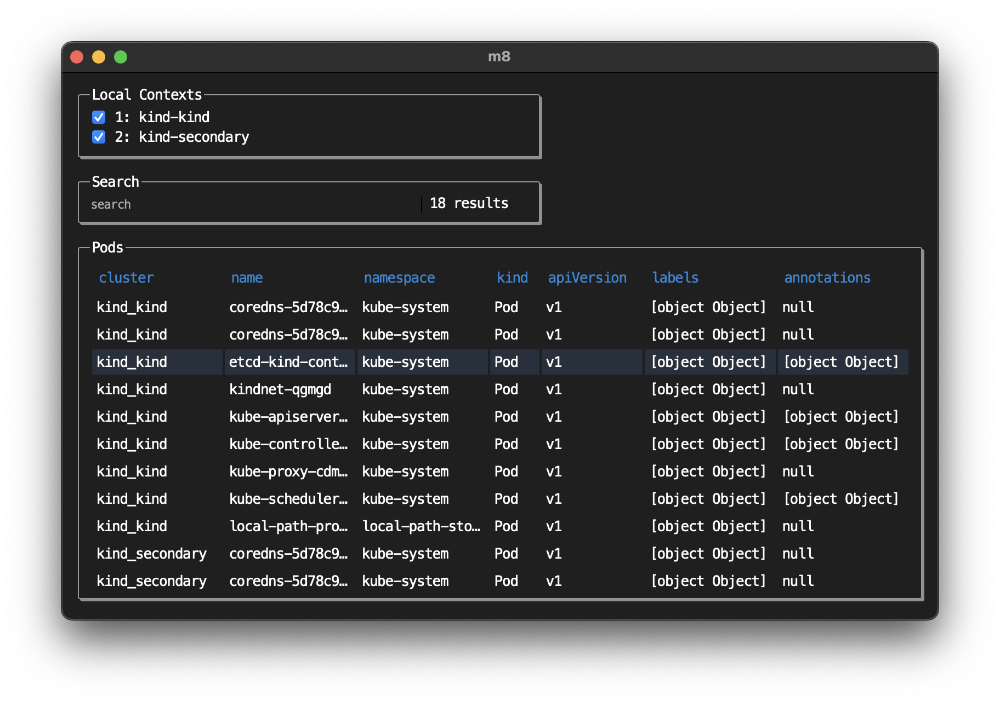

# Kube M8: Fast multi-cluster navigation for K8s admins

A desktop app Kubernetes client viewer, that stands on the shoulders of framework giants Svelte and Wails.

**This project is pre-release and under active development.**

Here's a list of things that work:
1. A dead simple UI/desktop application that features cross-context resource querying
2. A backend that connects to any cluster in your ~/.kube/config
3. A working GraphQL API with an Apollo client

Here's a list of future features:
1. Unit tests
2. Searching resources by short name, by plural noun, or fuzzy
3. Namespace filtering
4. Sorting columns lexicographically
5. Cluster info/stats display
6. Displaying/handling complex datastructures in the UI
7. Viewing raw yaml, events, and logs
8. Advanced features: responsive UI, shell/exec, port forwarding, edit resources, breadcrumb nav, graphql query builder for advanced queries

**Contributions for these features are welcome!**

## Getting Started
### Building from source
1. Install requirements below
2. Headless Mode: run `make` or `make run-with-deps` if it's your first time
3. Desktop Mode: run `wails dev` and follow the prompts. See below for more details
4. Navigate to http://localhost:8080/sandbox to interact with the GraphQL API via Apollo

### Requirements
1. Go
2. NPM
3. [Wails](https://wails.io/docs/gettingstarted/installation/)

### Additional Requirements for Makefile dev
1. [Kind](https://kind.sigs.k8s.io/docs/user/quick-start/#installation)

### Live Development
To run in live development mode, run `wails dev` in the project directory. This will run a Vite development
server that will provide very fast hot reload of your frontend changes. If you want to develop in a browser
and have access to your Go methods, there is also a dev server that runs on http://localhost:34115. Connect
to this in your browser, and you can call your Go code from devtools.

### Building
To build a redistributable, production mode package, use `wails build`.

## Contributing
### Pull Requests
There's something here for everyone! If you think this project has potential, please consider contributing.
### Issues/Bugs
If you have found an issue, please report it via Github issues. Please include as much detail as possible.